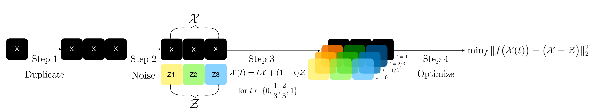
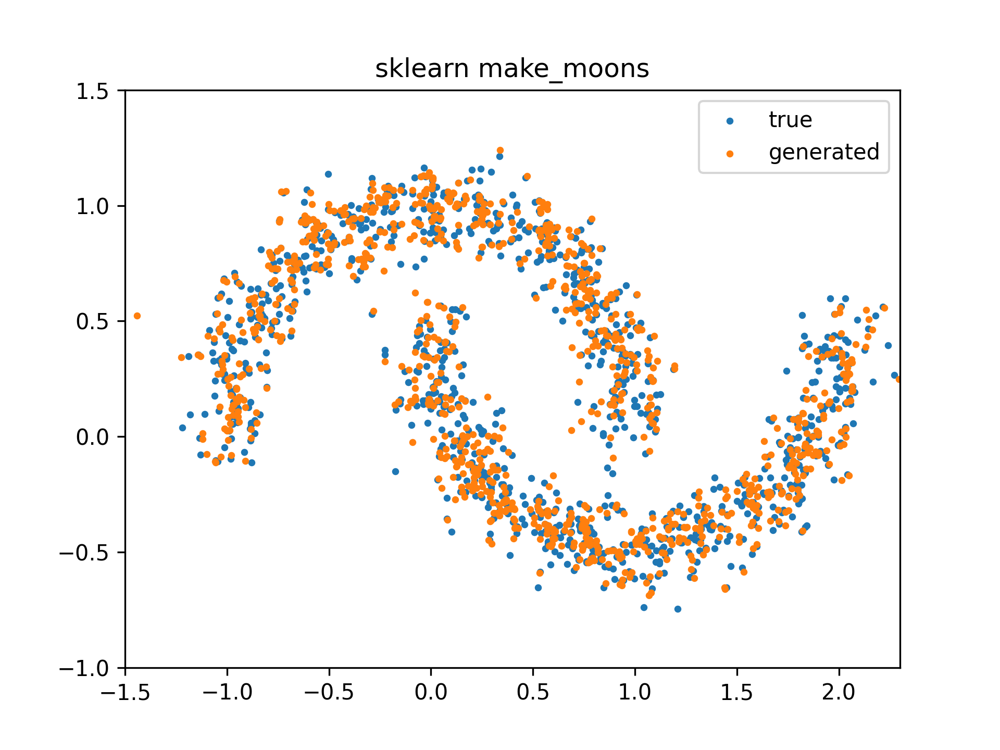

</img>

# Flow-Matching BDT for tabular data 

A minimal implementation of a genenerative model with [flow matching for tabular data](https://arxiv.org/abs/2309.09968). No deep learning - uses XGBoost to learn the generative model. 

The original implementation is available in [forest-diffusion](https://github.com/SamsungSAILMontreal/ForestDiffusion). Another implementation is available in the [`torchcfm`](https://github.com/atong01/conditional-flow-matching/tree/main/examples/tabular) library.

Unlike the implemenation in the `forest-diffusion`, we simplify the implemenatation by utilising `XGBoost`'s ability to predict multiple regression outputs.

## Usage

```python
from sklearn.datasets import make_moons

data, _ = make_moons(n_samples=1000, noise=0.1, random_state=0)
model = FlowMatchingBDT()

# train the model
model.fit(data)

# get new samples
num_samples = 1000
samples = model.predict(num_samples=num_samples)
```



If you'd like to do conditional generation:
```python
import numpy as np
from sklearn.datasets import make_moons

data, labels = make_moons(n_samples=1000, noise=0.1, random_state=42)
model = FlowMatchingBDT()

# train the model
model.fit(data, conditions=labels)

# get new samples
num_samples = 1000
conditions = np.ones(num_samples)
samples = model.predict(num_samples=num_samples, conditions=conditions)
```
## Resources
To learn more about flow matching for generative modelling check out these resources.

1. [Introduction to Flow Matching](https://mlg.eng.cam.ac.uk/blog/2024/01/20/flow-matching.html) Tor Fjelde, Emilie Mathieu, Vincent Dutordoir
2. [Generating Tabular Data with XGBoost](https://ajolicoeur.ca/2023/09/19/xgboost-diffusion/) Alexia Jolicoeur (Author of the ForestFlow paper)


## Citations
```bibtex
@inproceedings{jolicoeur2024generating,
  title={Generating and Imputing Tabular Data via Diffusion and Flow-based Gradient-Boosted Trees},
  author={Jolicoeur-Martineau, Alexia and Fatras, Kilian and Kachman, Tal},
  booktitle={International Conference on Artificial Intelligence and Statistics},
  pages={1288--1296},
  year={2024},
  organization={PMLR}
}
```

## Acknowlegements
This repository is inspired heavily and borrows parts from [`lucidrains`](https://github.com/lucidrains) (project structure) and [`torch-cfm`](https://github.com/atong01/conditional-flow-matching).
