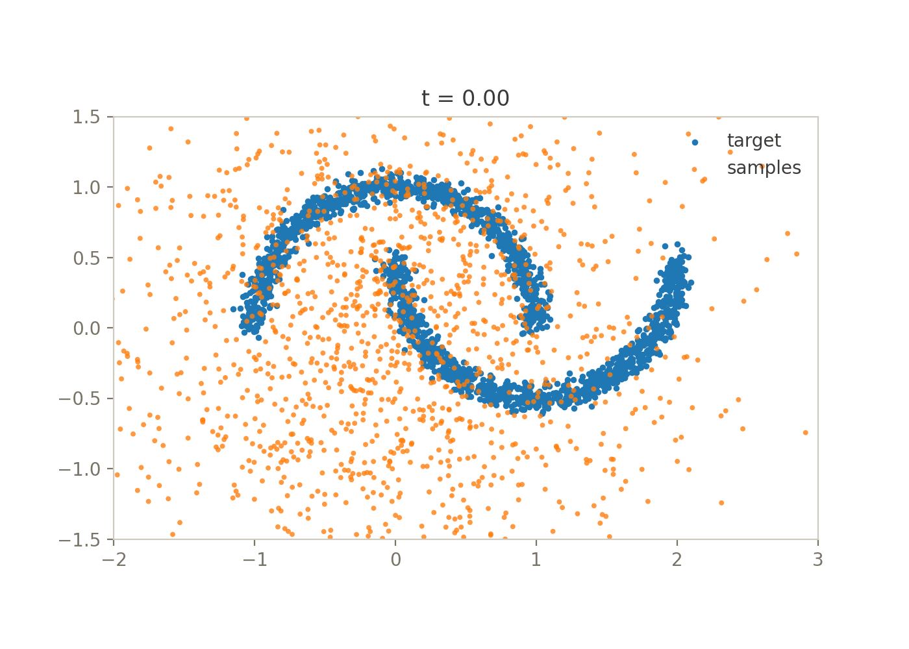

# Flow-Matching BDT

This is a small library for training flow-matching models. Its primary focus is using efficent algorithms for tabular learning - e.g histogram boosted-decision trees, but it works with any scikit-learn compatible regressor. 

<figure markdown="span">
  
  <figcaption> A model generating samples: Gaussian source distribution is progressively transformed into the two-moons target.</figcaption>
</figure>

## Installation

```bash
pip install flowmatching-bdt
```

## Quick Start

```python
from sklearn.datasets import make_moons
from flowmatching_bdt import FlowMatchingBDT

data, _ = make_moons(n_samples=500, noise=0.1, random_state=0)
model = FlowMatchingBDT(n_flow_steps=5, n_duplicates=10)

# train the model
model.fit(data)

# generate new samples
samples = model.predict(num_samples=500)
```

## Conditional Generation

```python
import numpy as np
from sklearn.datasets import make_moons
from flowmatching_bdt import FlowMatchingBDT

data, labels = make_moons(n_samples=500, noise=0.1, random_state=42)
model = FlowMatchingBDT(n_flow_steps=5, n_duplicates=10)

model.fit(data, conditions=labels)

conditions = np.ones(500)
samples = model.predict(num_samples=500, conditions=conditions)
```

## How It Works

Flow matching trains a model to predict a velocity field that transports samples from a simple source distribution (e.g. Gaussian noise) to the data distribution. This implementation:

1. Discretises the flow into `n_flow_steps` time steps
2. Trains one regressor per step to predict the velocity field
3. At inference, integrates the learned field using Euler steps to generate new samples

Gradient-boosted trees can learn this velocity field just as well as neural networks, while being faster to train on tabular data.

## Useful Resources

- [Introduction to Flow Matching](https://mlg.eng.cam.ac.uk/blog/2024/01/20/flow-matching.html) — Tor Fjelde, Emilie Mathieu, Vincent Dutordoir
- [Generating Tabular Data with XGBoost](https://ajolicoeur.ca/2023/09/19/xgboost-diffusion/) — Alexia Jolicoeur

## Citation
This repository started as a reproduction of the following paper:
```bibtex
@inproceedings{jolicoeur2024generating,
  title={Generating and Imputing Tabular Data via Diffusion and Flow-based Gradient-Boosted Trees},
  author={Jolicoeur-Martineau, Alexia and Fatras, Kilian and Kachman, Tal},
  booktitle={International Conference on Artificial Intelligence and Statistics},
  pages={1288--1296},
  year={2024},
  organization={PMLR}
}
```
